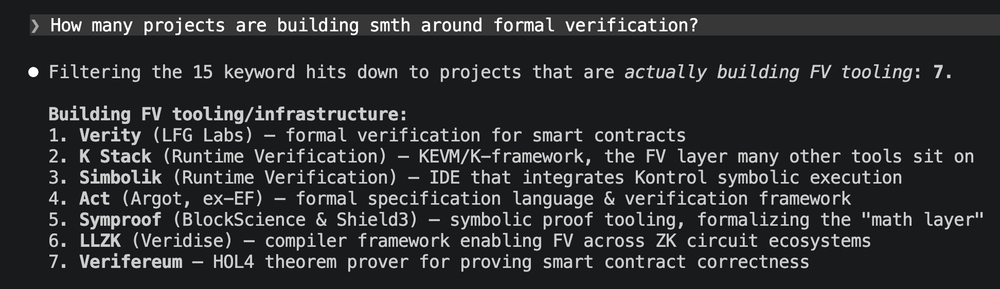
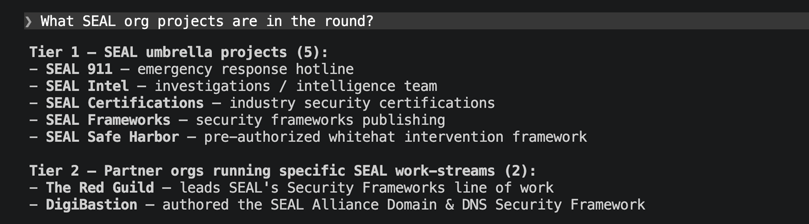
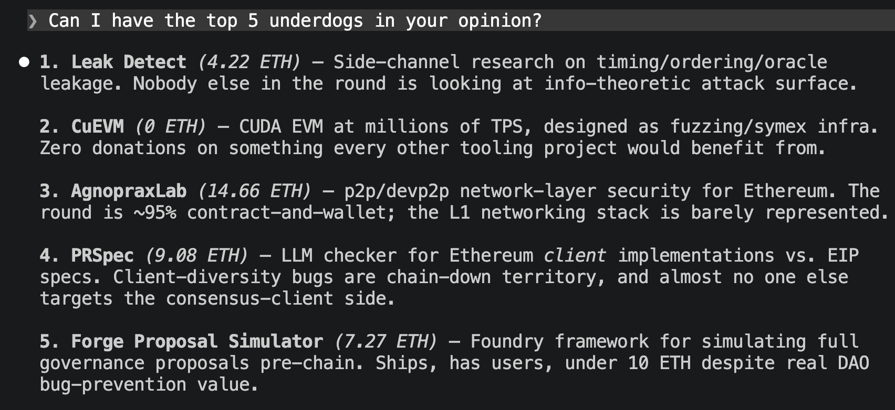

# the-dao-security-round-skill

A Claude Code skill that lets you research the **Giveth Ethereum Security** quadratic-funding round in plain English. 134 projects indexed locally; ask Claude things like *"which audit-tooling projects are in the round?"* or *"who's working on blob-data security?"* and it answers from real data.

## Install

Pick one. Both end up with the skill loaded in Claude Code.

### Option A — Plugin marketplace (recommended)

Inside Claude Code:

```
/plugin marketplace add https://github.com/ivanvolov/the-dao-security-round-skill.git
/plugin install the-dao-security-round@the-dao-security-round-skill
```

Update later with `/plugin update`.

### Option B — Manual git clone

```bash
git clone https://github.com/ivanvolov/the-dao-security-round-skill ~/.claude/skills/the-dao-security-round-skill
```

Restart Claude Code. Update later with `git pull` in that directory.

## What you can ask

Three questions worth trying first.

### "How many projects are building smth around formal verification?"



### "What SEAL org projects are in the round?"



### "Can I have the top 5 underdogs in your opinion?"



A few more shapes that work:

```
What does Blobscan do, and who runs it?
Which projects work on fuzzing?
How many projects mention zk circuits in their pitch?
Compare the block explorers in the round.
```

Claude shells out to a small Python CLI (`scripts/search.py`) that filters the indexed records and returns compact JSON, then answers from what came back. No invented projects, no fabricated builders.

## The round

**Ethereum Security QF Round** on Giveth — round id `16`, slug `ethereum-security`. Co-organized by [The DAO Fund](https://x.com/thedaofund) (commemorating the 10-year mark since The DAO incident) and [Giveth](https://giveth.io). Matching pool started at 500 ETH and has grown past 514 ETH with sponsor top-ups from [Chainsecurity](https://x.com/chain_security), [Quantstamp](https://x.com/Quantstamp) ($50,000), and [ECH Institute](https://x.com/ECHInstitute). 134 projects listed at the time the index was built.

Round page: <https://qf.giveth.io/qf/ethereum-security>

## Layout

```
the-dao-security-round-skill/
├── .claude-plugin/plugin.json   plugin manifest
├── SKILL.md                     instructions Claude reads
├── README.md                    this file
├── data/projects.json           134 consolidated project records
└── scripts/
    ├── search.py                query CLI (3 commands: projects, categories, show)
    └── build_index.py           rebuilds projects.json from RoundDetails/projects/*.json
```
